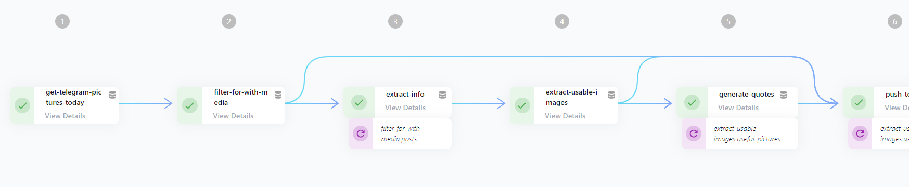

# AI Quote generator bot

This workflow is taking pictures from a telegram channel, extracting labels from the pictures with AWS Rekognition, generating a quote with chatgpt and lastly tweeting them to X (Twitter).

## Showcase of features

This workflow showcases all important features of the platform:

- using environment variables
- Using oauth secrets
- using meta values
- using dependencies between steps

## Quickstart

1. Create the necessary secrets
   1. Create a [telegram application](https://core.telegram.org/api/obtaining_api_id) and copy the tokens
      1. TELEGRAM_API_HASH
      2. TELEGRAM_API_ID
      3. TELEGRAM_API_SESSION
   2. Create an [oauth secret](https://edurata.com/global/secrets) with the scope `tweet.write` for X (Twitter) and connect it. Call it `TWITTER_API_BEARER_TOKEN` so it directly works with the provided template 
1. Go to deployments and [create a new deployment](https://edurata.com/deployments)
   1. Enter any name, e.g. `ai-forward-example`
   2. Enter as source repoUrl: `github.com/Edurata/edurata-workflows` and path `examples/ai-image-forward` and ref `main`
   3. Save and deploy
1. Run the deployment

## Workflow

- [definition](https://github.com/Edurata/edurata-workflows/blob/main/examples/ai-image-forward.yaml)

## Most important functions
- [get-telegram-pictures-today](https://github.com/Edurata/edurata-functions/blob/main/etl/extract/fetch-telegram): This function is fetching pictures from a telegram channel.
- [extract-info](https://github.com/Edurata/edurata-functions/blob/main/etl/extract/analyse-image-aws-rekognition): This function is extracting labels from an image using AWS Rekognition.
- [generate-quotes](https://github.com/Edurata/edurata-functions/blob/main/etl/transform/chatgpt): This function is generating a quote from a label. It is using the [chatgpt](https://pypi.org/project/chatgpt/) library.
- [tweet](https://github.com/Edurata/edurata-functions/blob/main/etl/load/tweet): This function is tweeting a message with api calls.