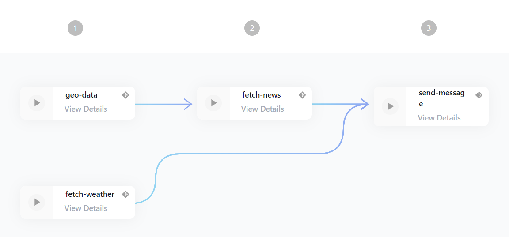

# Hello World App

This workflow is taking a message as input and sends runs it through the whalesay command. It is just meant as a showcase so the end result is not very useful.

## Quickstart

1. Go to deployments and [create a new deployment](https://edurata.com/deployments)
   1. Enter any name, e.g. `hello-world-example`
   2. Enter as source repoUrl: `github.com/Edurata/edurata-workflows` and path `examples/hello-world.yaml` and ref `main`
   3. Save and deploy

## Showcase of features

- Testing the basic functionality of printing in python nodejs, inline code and a container
- Using secrets

## Workflow

- [definition](https://github.com/Edurata/edurata-workflows/blob/main/examples/breakfast-info.eduwc.yaml)

## Functions

- [axios](https://github.com/Edurata/edurata-functions/blob/main/general/axios): This function is calling an API and returning the result. It is using the [axios](https://www.npmjs.com/package/axios) library.
- [send-ses](https://github.com/Edurata/edurata-functions/blob/main/etl/load/send-ses): This function is sending an email through AWS SES. It is using the [botocore](https://pypi.org/project/botocore/) library.
